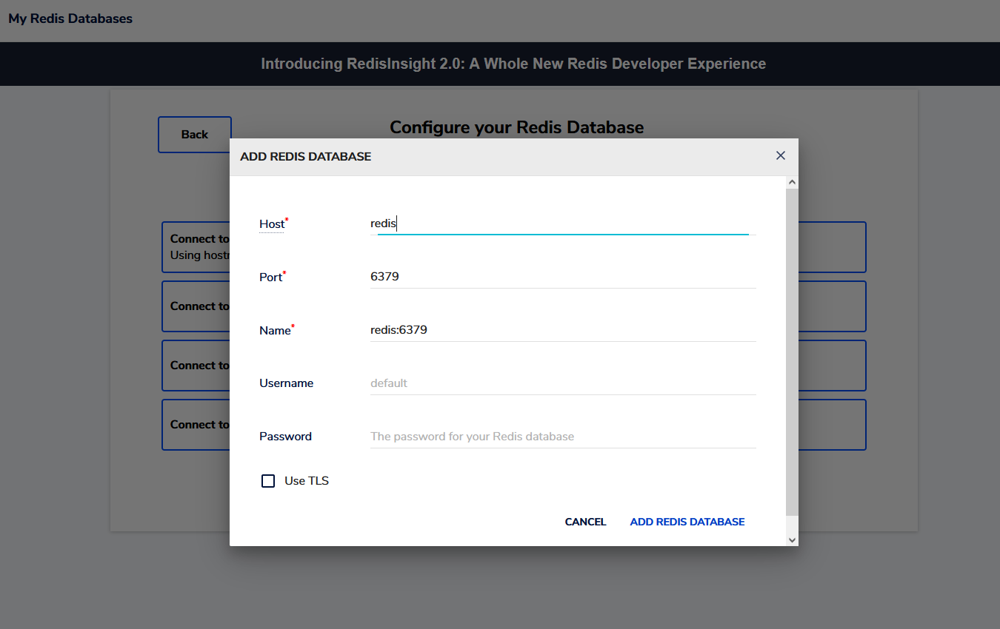
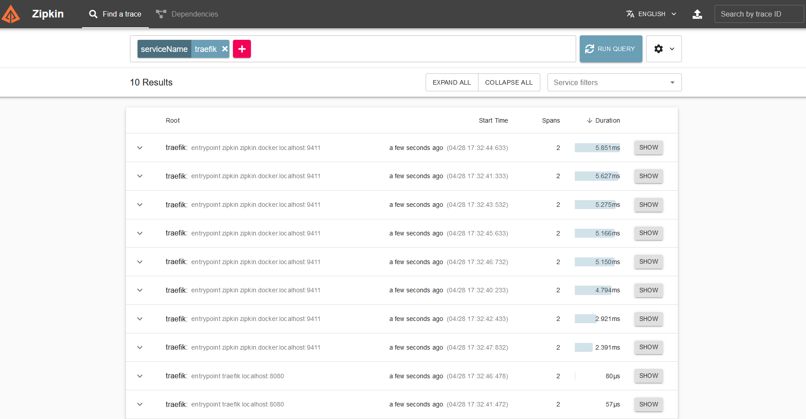

# 05 Traefik Advanced

You have reached the final step of this tutorial. Congrats.

## Warning

> Depending on your os you need to change the docker socket to fit your system.

```yaml
# docker-compose-yml
version: '3.7'
services:
  socket-proxy:
    image: tecnativa/docker-socket-proxy
    container_name: socket-proxy
    volumes:
      # Docker Desktop (Windows or Mac OSX)
      - /var/run/docker.sock:/var/run/docker.sock
      # Linux only
      #- /var/run/user/1000/docker.sock:/var/run/docker.sock:ro
```

## Features

- Traefik
- Redis
- Redis Insight
- Golang Webserver
- NextJS App to interact with Redis
- Whoami Container with rate-limiting
- Zipkin Tracing

## Start the project

See all logs from docker-compose

```bash
  make dev
```

Hide all logs from docker-compose

```bash
  make start
```

## Websites

- [Traefik](http://localhost:8080/dashboard)
- [Redisinsight](http://redisinsight.docker.localhost)
- [Whoami](http://whoami.docker.localhost)
- [Fibonacci](http://fibo.docker.localhost)
- [NextJS](http://next.docker.localhost)
- [Zipkin](http://zipkin.docker.localhost:9411/zipkin/)

## FAQ

#### How do I inspect the redis image with redisinsight

1. Open the - [Redisinsight](http://redisinsight.docker.localhost) website, accept the EULA and click on "I already have a database".
2. Click on "Connect to a Redis Database". "Using hostname and port"
3. Copy this connection url **redis:6379** and insert it into the "Host" field
   
4. Press "ADD REDIS DATABASE"

#### How do I hit the rate-limit

Open the [Whoami](http://whoami.docker.localhost) website and press reload as fast as you can.

#### Can I change the rate limit of the whoami container

Yes. Just change the limit from

```yaml
traefik.http.middlewares.http-ratelimit.ratelimit.average=1
traefik.http.middlewares.http-ratelimit.ratelimit.burst=2
```

to

```yaml
traefik.http.middlewares.http-ratelimit.ratelimit.average=5
traefik.http.middlewares.http-ratelimit.ratelimit.burst=20
```

#### How do I view traces from traefik

Open the [Whoami](http://zipkin.docker.localhost:9411/zipkin/) website and press the read + button.
Click serviceName and enter traefik.

